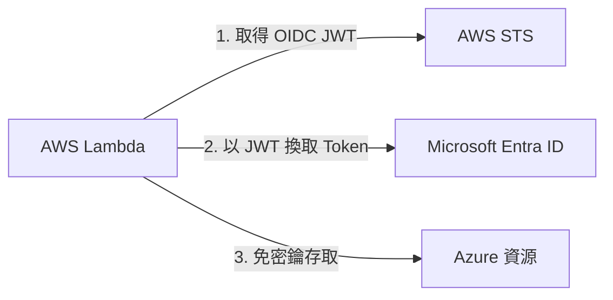

# 跨雲端身分同盟：AWS 透過 Workload Identity Federation 免金鑰（Keyless）存取 Azure 資源實務筆記

之前寫過一篇[使用 Workload Identity Federation 跨雲端存取 GCP 的資源 ](../google-cloud-platform/04-workload-identity-federation.md) 的筆記，這次輪到 Azure 了，以我自己工作中的專案為例，簡單的紀錄該如何透過 Workload Identity Federation 跨雲端存取 Azure 資源，並且不使用任何金鑰與憑證。

## 架構概念與演化

### 過去做法的痛點（Anti-Pattern）

在過去，AWS 工作負載（如 Lambda、EC2、ECS）若要存取 Azure 資源（Azure Resource Manager、Graph API、Policy Insights 等），通常需要在 Azure Entra ID 建立 App Registration，並搭配以下其中一種方式：

1. **Client Secret（靜態金鑰）**：長效密碼，有洩漏與定期手動更換的風險。
2. **X.509 Client Certificate（自簽憑證）**：通常設定 30～90 天有效，需將私鑰存於 AWS Secrets Manager，並在 Lambda 引入龐大的 `msal` 與 C-extension（如 `cryptography`）Layer，維護成本與冷啟動負擔極大。

### 現代 Keyless 作法（Workload Identity Federation / FIC）

藉由 **OpenID Connect (OIDC)** 協定，讓 Azure Microsoft Entra ID 直接信任 AWS IAM 簽發的短效 OIDC JWT。整個流程**零靜態密碼、零私鑰儲存、零憑證輪替**：



## AWS 端配置

### 啟用 AWS Outbound Web Identity Federation

AWS 帳號預設未開啟向外簽發 OIDC Token 的功能，必須由管理者執行一次性的啟用指令：

```bash
aws iam enable-outbound-web-identity-federation
```

> **重要特性**：啟用後，AWS STS 不會使用通用的 `https://sts.amazonaws.com` 當作 Token 簽發者，而是會為該 AWS 帳號指派一個**全域唯一的 OIDC Issuer URL**，格式如下：
> `https://<ACCOUNT_DEDICATED_UUID>.tokens.sts.global.api.aws`

### 配置 Lambda / Workload 的 IAM Execution Role

執行工作負載的 IAM Role 需要允許向 STS 索取身份 Token：

```json
{
    "Version": "2012-10-17",
    "Statement": [
        {
            "Sid": "AllowGetWebIdentityToken",
            "Effect": "Allow",
            "Action": "sts:GetWebIdentityToken",
            "Resource": "*"
        }
    ]
}
```

## 使用 Terraform 建立相關資源

使用 Terraform 的 `azuread` Provider，在 Azure 端建立 App Registration 並設定同盟憑證（Federated Identity Credential, FIC）。

### 資源定義範例

```hcl
terraform {
    required_providers {
        aws = {
            source  = "hashicorp/aws"
            version = ">= 6.0"
        }
        azuread = {
            source  = "hashicorp/azuread"
            version = "~> 3.0"
        }
    }
}

# 動態取得此 AWS 帳號啟用 Outbound Federation 後的專屬 OIDC Issuer URL
# (格式為 https://xxxxxxxx-xxxx-xxxx-xxxx-xxxxxxxxxxxx.tokens.sts.global.api.aws)
data "aws_iam_outbound_web_identity_federation" "current" {}

# 1. 建立 Azure AD App Registration 與 Service Principal
resource "azuread_application" "my_app" {
    display_name = "my-company-cross-cloud-worker"
    description  = "Keyless workload identity for AWS Lambda worker"
}

resource "azuread_service_principal" "my_app" {
    client_id = azuread_application.my_app.client_id
}

# 2. 建立 Federated Identity Credential (FIC)
resource "azuread_application_federated_identity_credential" "aws_lambda" {
    application_id = azuread_application.my_app.id
    display_name   = "aws-lambda-worker"
    description    = "Trusts AWS IAM execution role for Lambda"

    # 固定值：Microsoft Entra ID 規定的 Token Exchange Audience
    audiences      = ["api://AzureADTokenExchange"]

    # 關鍵：動態填入該 AWS 帳號專屬的 OIDC Issuer URL
    issuer         = data.aws_iam_outbound_web_identity_federation.current.issuer_identifier

    # 關鍵：填入被允許換取 Token 的完整 AWS IAM Role ARN
    subject        = "arn:aws:iam::123456789012:role/my-lambda-execution-role"
}
```

> **權限指派**：建立完 `azuread_service_principal` 後，記得到 Azure Portal 或透過 `azurerm_role_assignment` 賦予該 Service Principal 相應的 RBAC 角色（例如 Reader、Contributor 或 Policy Insights 權限）。

## Python 程式碼實作（使用 requests 套件）

捨棄肥大的 `msal` SDK，使用簡潔直覺的 **`requests`** 搭配 AWS 原生 **`boto3`**，大幅精簡程式碼並免除 URL 編碼與換證的繁瑣細節。

```python
import os
import boto3
import requests

# 從環境變數讀取配置
AZURE_TENANT_ID = os.environ["AZURE_TENANT_ID"]
AZURE_CLIENT_ID = os.environ["AZURE_CLIENT_ID"]
AZURE_SCOPE     = "https://management.azure.com/.default"
AWS_REGION      = os.environ.get("AWS_REGION", "us-west-2")


def get_azure_bearer_token() -> str:
    """
    透過 AWS STS Outbound Identity Federation 向 Entra ID 換取 Azure Access Token
    """
    # 1. 向 AWS STS 請求 OIDC JWT Token
    sts = boto3.client("sts", region_name=AWS_REGION)
    aws_jwt = sts.get_web_identity_token(
        Audience=["api://AzureADTokenExchange"],  # 必須為 List 型態
        SigningAlgorithm="RS256",                # 必須指定 RS256
    )["WebIdentityToken"]

    # 2. 向 Microsoft Entra ID Token 端點發送 RFC 7523 client_credentials 換證請求
    token_url = f"https://login.microsoftonline.com/{AZURE_TENANT_ID}/oauth2/v2.0/token"
    resp = requests.post(
        token_url,
        data={
            "grant_type": "client_credentials",
            "client_id": AZURE_CLIENT_ID,
            "client_assertion_type": "urn:ietf:params:oauth:client-assertion-type:jwt-bearer",
            "client_assertion": aws_jwt,
            "scope": AZURE_SCOPE,
        },
        timeout=30,
    )
    resp.raise_for_status()
    return resp.json()["access_token"]


def lambda_handler(event, context):
    # 1. 取得 Azure Token
    token = get_azure_bearer_token()

    # 2. 操作 Azure 資源 (以列出訂用帳戶為例)
    api_url = "https://management.azure.com/subscriptions?api-version=2022-12-01"
    resp = requests.get(
        api_url,
        headers={"Authorization": f"Bearer {token}"},
        timeout=30,
    )
    resp.raise_for_status()

    subscriptions = resp.json().get("value", [])
    print(f"成功取得訂閱項目數量: {len(subscriptions)}")

    return {"status": "success", "count": len(subscriptions)}
```

## 改造效益評估

1. **安全性極大化**：全架構無任何靜態帳密、無 Private Key，徹底免疫金鑰洩漏風險。
2. **零維運負擔（Zero Toil）**：不再需要每 30～90 天輪替自簽憑證與手動更新 Secrets Manager。
3. **輕量外部相依（Lightweight）**：捨棄肥大的 MSAL 與 C-extension（如 `cryptography`），僅依賴 `requests`，兼顧開發簡潔度與維護性。

## 參考資料

- [Federating AWS Identities to external services](https://docs.aws.amazon.com/IAM/latest/UserGuide/id_roles_providers_outbound.html)
