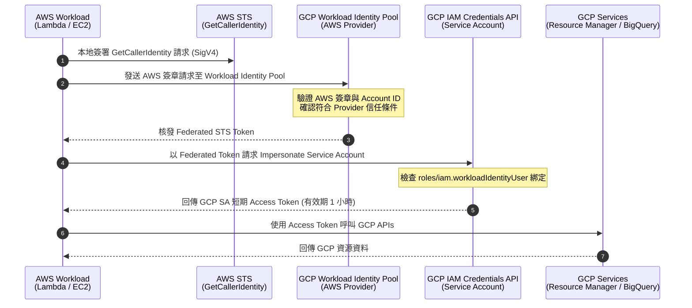

# Workload Identity Federation (AWS to GCP)

傳統上跨雲存取（例如從 AWS Lambda 存取 GCP 資源）常使用 Service Account Key (JSON) 並存放在 Secrets Manager。然而，金鑰有外洩風險與輪替負擔。

**Workload Identity Federation (WIF)** 是 Google Cloud 推薦的無金鑰（Keyless）最佳實踐。它透過 OIDC / AWS STS 建立跨雲身分信任，讓 AWS IAM Role 能直接向 GCP 換取短期 Access Token，完全不需管理長期金鑰。

---

## 1. 運作流程與架構



---

## 2. 使用 Terraform 建立 WIF 資源

### 2.1 啟用必要的 GCP API

```hcl
resource "google_project_service" "required_apis" {
  for_each = toset([
    "iam.googleapis.com",
    "iamcredentials.googleapis.com",
    "sts.googleapis.com",
    "cloudresourcemanager.googleapis.com",
  ])
  project            = "my-gcp-project"
  service            = each.key
  disable_on_destroy = false
}
```

### 2.2 建立 Service Account 與權限

```hcl
resource "google_service_account" "app_sync" {
  account_id   = "sa-cloud-sync"
  display_name = "Cloud Sync Service Account"
  project      = "my-gcp-project"
}

# 賦予 SA 操作目標資源的權限（例如專案 Viewer）
resource "google_project_iam_member" "project_viewer" {
  project = "my-gcp-project"
  role    = "roles/viewer"
  member  = "serviceAccount:${google_service_account.app_sync.email}"
}
```

### 2.3 建立 Workload Identity Pool 與 AWS Provider

```hcl
# 1. 建立 Pool
resource "google_iam_workload_identity_pool" "aws_pool" {
  project                   = "my-gcp-project"
  workload_identity_pool_id = "my-aws-pool"
  display_name              = "AWS Workload Identity Pool"
}

# 2. 建立 AWS Provider 並設定屬性映射與條件
resource "google_iam_workload_identity_pool_provider" "aws_provider" {
  project                            = "my-gcp-project"
  workload_identity_pool_id          = google_iam_workload_identity_pool.aws_pool.workload_identity_pool_id
  workload_identity_pool_provider_id = "my-aws-provider"
  display_name                       = "AWS Provider"

  attribute_mapping = {
    "google.subject"        = "assertion.arn"
    "attribute.aws_account" = "assertion.account"
    "attribute.aws_role"    = "assertion.arn.extract('/{role_name}/')"
  }

  # 限制只有指定的 AWS Account 可以換證
  attribute_condition = "assertion.account == '123456789012'"

  aws {
    account_id = "123456789012"
  }
}
```

### 2.4 授權 AWS IAM Role 扮演該 Service Account

```hcl
resource "google_service_account_iam_binding" "workload_identity_user" {
  service_account_id = google_service_account.app_sync.name
  role               = "roles/iam.workloadIdentityUser"

  members = [
    # 精確授權特定的 AWS IAM Role 扮演
    "principalSet://iam.googleapis.com/${google_iam_workload_identity_pool.aws_pool.name}/attribute.aws_role/my-lambda-execution-role"
  ]
}
```

---

## 3. 產出 WIF 設定檔格式 (Credential Config)

WIF 設定檔不包含任何私鑰或密鑰，**純粹由公開的資源識別字串組成**，因此可安全放在程式碼變數或 Lambda 環境變數中：

```json
{
    "type": "external_account",
    "audience": "//iam.googleapis.com/projects/PROJECT_NUMBER/locations/global/workloadIdentityPools/my-aws-pool/providers/my-aws-provider",
    "subject_token_type": "urn:ietf:params:aws:token-type:aws4_request",
    "service_account_impersonation_url": "https://iamcredentials.googleapis.com/v1/projects/-/serviceAccounts/sa-cloud-sync@my-gcp-project.iam.gserviceaccount.com:generateAccessToken",
    "token_url": "https://sts.googleapis.com/v1/token",
    "credential_source": {
        "environment_id": "aws1",
        "regional_cred_verification_url": "https://sts.us-west-2.amazonaws.com?Action=GetCallerIdentity&Version=2011-06-15"
    }
}
```

---

## 4. Python SDK 整合

在 Python 應用程式中，使用 `google-auth` 直接由記憶體載入設定：

```python
import json
import os
import google.auth
from google.auth.transport.requests import Request
from google.cloud import resourcemanager_v3

def get_gcp_credentials():
    wif_config_str = os.getenv("GCP_WIF_CREDENTIALS_CONFIG")

    if wif_config_str:
        info = json.loads(wif_config_str)
        # 注意：必須明確指定 default_scopes，否則在進行 SA Impersonation 時會因缺少 scope 報錯 400
        credentials, _ = google.auth.load_credentials_from_dict(
            info,
            default_scopes=["https://www.googleapis.com/auth/cloud-platform"]
        )

        return credentials

    # 本地開發 fallback 至 ADC (gcloud auth application-default login)
    credentials, _ = google.auth.default(
        scopes=["https://www.googleapis.com/auth/cloud-platform"]
    )

    return credentials

# 呼叫 GCP API
credentials = get_gcp_credentials()
client = resourcemanager_v3.ProjectsClient(credentials=credentials)
project = client.get_project(name="projects/my-gcp-project")
print(f"Project ID: {project.project_id}")
```

---

## 參考資料

- [Google Cloud 官方文件：Workload Identity Federation for AWS](https://cloud.google.com/iam/docs/workload-identity-federation-with-other-clouds#aws)
- [Managing short-lived service account credentials](https://cloud.google.com/iam/docs/creating-short-lived-service-account-credentials)
