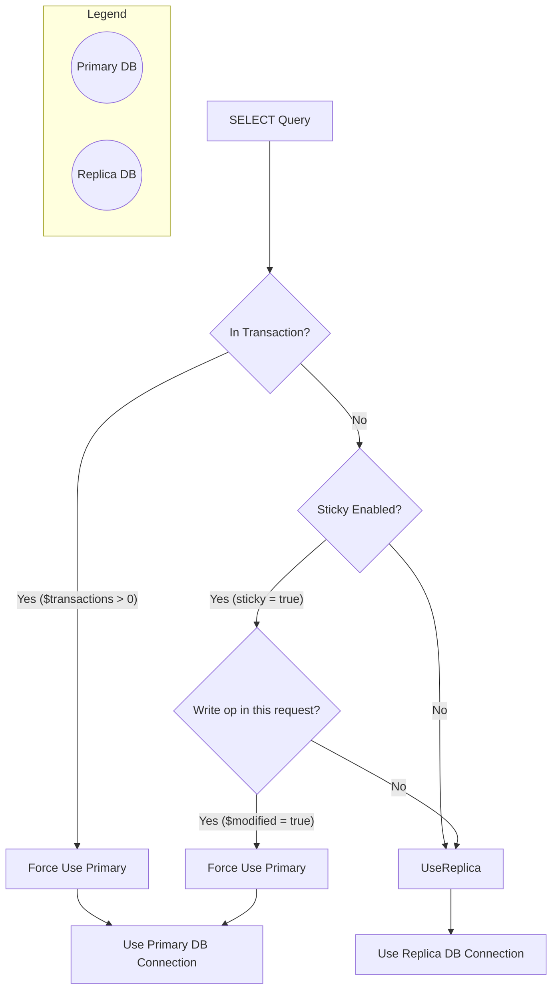

# Laravel 讀寫分離、Sticky Reads 與 Transaction 底層機制筆記

## 1. 核心觀念總覽

在 Laravel 讀寫分離（Read/Write Splitting）架構下，Laravel 內部管理著兩個 PDO 實例：

- **`readPdo`**：指向 Read Replica（從庫），處理 `SELECT`。
- **`writePdo` (Primary)**：指向 Primary DB（主庫），處理 `INSERT` / `UPDATE` / `DELETE` / `TRANSACTION`。

當執行 `SELECT` 查詢時，Laravel 會透過 `getReadPdo()` 判斷要拿哪一個 PDO：

## 2. 深入剖析三種情境

### 情境 A：`DB::transaction()` 的運作機制

- **行為**：當呼叫 `DB::transaction()` 時，Laravel 的 Transaction 計數器 `$transactions` 會增加。
- **底層**：只要 `$transactions > 0`，`getReadPdo()` 會直接回傳 Primary PDO。
- **重點**：
- Transaction 期間的所有查詢保證走 Primary 主庫。
- **交易結束後（`COMMIT` / `ROLLBACK`）**，`$transactions` 歸零。若沒有開啟 `sticky => true`，下一個 Transaction 外的 `SELECT` **會立刻切換回 Replica 從庫**！

### 情境 B：開啟 `sticky => true` 的運作機制

- **行為**：為單一 HTTP Request（生命週期）提供「Read-Your-Own-Writes」的一致性。
- **底層**：

1. 一開始的 `SELECT` 走 `readPdo`（Replica）。
2. 當執行任何寫入語法（`INSERT`/`UPDATE`/`DELETE`）時，Laravel 將連線狀態的 `$modified` 設為 `true`。
3. 此 Request 剩下的時間內，所有 `SELECT` 的 `getReadPdo()` 都會直接改回傳 Primary PDO。

- **重點**：
- `sticky` **不會**自動開啟，必須在 `config/database.php` 顯式聲明 `'sticky' => true`。
- `sticky` 狀態**不會跨 Request 共享**，也**不會**改變資料庫自身的 Isolation Level。

### 情境 C：Transaction + Sticky 組合拳

- 在一個 HTTP Request 中，如果執行了 `DB::transaction()` 並且內部有寫入：

1. Transaction 期間：因為 `$transactions > 0`，走 Primary。
2. Transaction 寫入時：標記 `$modified = true`。
3. Transaction Commit 結束後：因為 `$modified` 已被標記為 `true`，**後續 Transaction 外的普通 SELECT 依然會繼續走 Primary**。

## 3. 常見迷思與誤區（Debunking Mistakes）

### ❌ 迷思 1：「在 Transaction 裡的讀寫會拆成兩個 DB 事務」

- **事實**：如果是使用 Laravel ORM / DB Facade 的預設連線，Laravel 會在 Transaction 期間強制把所有 Read 導向 Primary，因此**只會有一個 DB 連線、一個 DB 事務**。
- **例外**：除非開發者在閉包內手動寫死 `DB::connection('replica_connection')->select(...)` 硬指派不同連線，才會變成兩個獨立事務。

### ❌ 迷思 2：「Sticky 可以解決 Replication Lag 帶來的所有問題」

- **事實**：Sticky 只能解決「同一 Request 內」先寫後讀的 Replication Lag。
- **無效情境**：
- **跨 Request**：使用者在 A 頁面 Submit（Request 1 寫入主庫），跳轉到 B 頁面（Request 2 讀取從庫）。對 Request 2 來說 `$modified` 為 `false`，若從庫尚未同步完成，依然會讀到舊資料。
- **非同步 Queue Job**：主程式發送寫入並丟出 Job，Job 跑在獨立進程，讀取 Replica 時依然可能遇到 Replication Lag。

### ❌ 迷思 3：「Sticky 會覆蓋 DB 的 Isolation Level」

- **事實**：`sticky` 只是 Laravel 框架層級的 **SQL 路由開關**。當 SQL 被送到 Primary 主庫後，依然受限於 MySQL / PostgreSQL 設定的隔離層級（如 `Repeatable Read` 的快照讀機制）。

## 4. 最佳實踐建議 (Best Practices)

1. **生產環境建議啟用 `sticky => true**`：
   在所有讀寫分離的 Laravel 專案中，`config/database.php` 的 MySQL 設定應預設啟用 `'sticky' => true`，能以極低成本避免 80% 以上同 Request 內的髒讀問題。
2. **關鍵資料讀取（如支付/庫存）使用 `lockForUpdate()` 或強指 Primary**：
   若某些邏輯不容許任何 Replication Lag，且不在 Transaction 內，可以使用 `DB::connection('mysql')->useWriteConnection()->select(...)` 確保讀取主庫。
3. **跨 Request 一致性需靠架構設計**：
   針對跨頁面/跨 Request 的寫後讀問題，應考慮快照快取（Cache）、Optimistic Locking（樂觀鎖）或在前端做 UI 狀態異步過渡，而非單純依賴 `sticky`。

## 參考資料

- [Read/Write Splitting, Connection Pooling, and Sticky Reads in Laravel](https://msaied.com/articles/readwrite-splitting-connection-pooling-and-sticky-reads-in-laravel-1)
- [Laravel - Database: Getting Started](https://laravel.com/docs/13.x/database)
