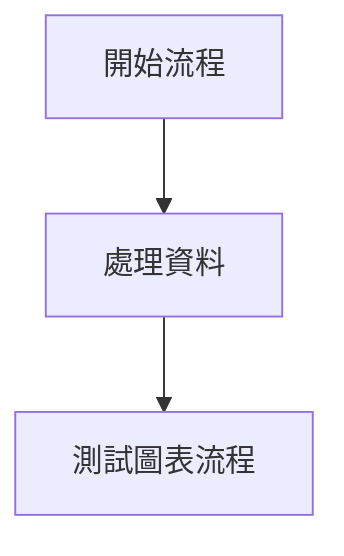

# Test Fixtures

最近藉著 AI Coding，幫自己的 Markdown 筆記架設了一個漂亮的靜態展示網頁。畫面上除了能正確為程式碼區塊進行語法高亮（Syntax Highlighting），甚至還支援用 Mermaid 繪製流程圖。看著自己的筆記能被如此精美地呈現，讓做筆記這件事變得更有成就感。

不過在為這個專案編寫測試時，我一開始沒想太多，為了驗證程式碼高亮與 Mermaid 是否正常渲染，便隨手拿了現有的筆記內容來當作測試標的。但轉念一想：今後只要我對筆記內容有任何修訂、重構甚至檔名微調，這些無關的測試都有可能無預警壞掉。這種與真實資料過度耦合的做法顯然不是長久之計，因此這篇筆記想記錄如何使用 **Test Fixture（測試夾具）** 來優雅的解決這個問題。

---

## 什麼是 Test Fixture？

「Fixture」一詞原本來自機械製造業，**指的是「夾具」或「定位治具」**。

在工廠生產線上，如果工人想要精準加工或檢驗某個零件，會先用特製的夾具將零件**固定在已知且穩固的位置**，確保每一次測量或加工都在完全相同的基準條件下進行。

在軟體測試中，**Test Fixture 代表的是「執行測試前，所準備好的已知、固定且可重複產生的基準環境或資料狀態」**。

> **核心價值：**
> 無論你在誰的電腦上跑、跑了一百次、或是專案的正式內容怎麼被修改，測試都能在**完全可控且一致的基準**下執行。

---

## 為什麼需要 Test Fixture？（解決真實資料測試的痛點）

如果直接拿正式資料進行測試，常會面臨以下問題：

| 直接依賴真實資料的缺點                                                                                                        | 引入 Fixture 的好處                                                                                          |
| :---------------------------------------------------------------------------------------------------------------------------- | :----------------------------------------------------------------------------------------------------------- |
| **容易無預警損壞（Brittle Tests）**<br>例如內容維護者修改了正式文章的標題、排版或語法，無關的自動化測試就連帶失敗。           | **解耦與獨立性（Decoupling）**<br>測試與正式資料完全分離，正式內容隨意修改重構都不會影響測試通過。           |
| **資料變動造成測試不穩定（Flaky Tests）**<br>真實資料庫或檔案可能隨時增刪，今天會過的測試明天可能因為缺少某筆關聯資料而失敗。 | **確定性與可重現（Determinism）**<br>每次執行測試時輸入的資料都是 100% 已知的，結果具備一致性。              |
| **測試意圖模糊**<br>真實文章動輒幾千字，很難一眼看懂測試到底是在測哪一行程式碼或哪種特殊語法。                                | **意圖聚焦（Focused Intent）**<br>測試夾具只包含**驗證該情境所需的最小語料**（例如只放 3 行 Mermaid 語法）。 |

---

## 常見的 Test Fixture 形式

在 Web 與 Laravel / Pest 測試中，Fixture 主要有以下三種常見形式：

### 1. File Fixtures

當應用程式需要解析外部檔案（如 Markdown、CSV、Excel、PDF 或第三方 API 的 JSON 回應）時，在 `tests/Fixtures/` 目錄下放置專門用於測試的小型樣本檔案。

```text
tests/
└── Fixtures/
    └── notes/
        ├── README.md
        └── testing/
            ├── 01-code-blocks.md  # 專門測試語法高亮
            ├── 02-mermaid.md      # 專門測試圖表渲染
            └── 03-images.md       # 專門測試圖片放大
```

### Database Fixtures

透過 Laravel 的 **Model Factories** 或專屬的 **Test Database Seeder**，在每個測試前建立乾淨且符合特定狀態的模型實例。

```php
// 利用 Factory 建立符合特定狀態的資料庫夾具
$user = User::factory()->admin()->create();
```

### Lifecycle Fixtures

利用 Pest 的 `beforeEach()`、`afterEach()` 或是設定測試專屬的環境變數，建立隔離的運行環境。

```php
beforeEach(function () {
    // 切換設定指向測試專屬目錄
    config(['notes.path' => base_path('tests/Fixtures/notes')]);
});
```

---

## 案例：將 Markdown 筆記渲染測試與真正的筆記內容解耦

以本專案為例，原本瀏覽器測試（Pest Browser Testing）為了驗證 Mermaid 圖表是否有成功渲染，直接造訪了正式筆記庫中的文章：

### ❌ 重構前：直接依賴正式筆記

```php
test('it leaves mermaid code intact and renders mermaid svg diagram', function () {
    // 依賴真實的 Laravel 筆記
    $page = visit('/laravel/laravel-read-write-splitting');

    $page->assertNoJavascriptErrors()
        ->assertPresent('.mermaid-diagram-container svg')
        ->assertSee('Laravel 讀寫分離'); // 若文章改名或改寫內容，測試即崩潰
});
```

這造成任何對 `resources/notes/` 內容的正常編輯，都可能意外打壞測試。

---

### ✅ 重構後：引入 `tests/Fixtures/notes` 測試夾具

#### 步驟 1：建立專屬的測試用假筆記

在 `tests/Fixtures/notes/testing/02-mermaid.md` 中建立僅包含待測語法的精簡內容：

````markdown
# Mermaid Diagram Testing


````

#### 步驟 2：支援環境切換

讓 `config/notes.php` 支援 `NOTES_PATH` 環境變數，並在 `phpunit.xml` 中預設指向測試夾具目錄：

```xml
<!-- phpunit.xml -->
<php>
    <env name="NOTES_PATH" value="tests/Fixtures/notes"/>
</php>
```

#### 步驟 3：測試改用清晰的假筆記路由

```php
test('it leaves mermaid code intact and renders mermaid svg diagram', function () {
    // 造訪測試夾具提供的固定路由
    $page = visit('/testing/mermaid');

    $page->assertNoJavascriptErrors()
        ->assertPresent('.mermaid-diagram-container svg')
        ->assertSee('測試圖表流程');
});
```

測試路徑從 `/laravel/laravel-read-write-splitting` 變成語意清晰的 `/testing/mermaid`，測試意圖一目了然，且正式筆記隨意修改皆不影響測試！

---

## 最佳實踐守則

1. **最小必要原則（Minimalism）**：Fixture 檔案或資料只放測試必需的內容，避免冗餘文字干擾焦點。
2. **語意明確（Self-documenting）**：檔案名稱與測試路由應能直接表達測試目的（例如 `02-mermaid.md`、`sample-invoice.pdf`）。
3. **保持測試獨立（Isolation）**：如果測試會修改 Fixture（例如寫入檔案或更新資料），應在測試結束後（`afterEach`）復原，避免測試之間互相干擾。
4. **真實資料驗證交給專門的 Check**：如果仍需要確認真實內容是否完好，可以另外撰寫單獨的驗證測試（如 `ArchTest` 檢查規範、`PageTest` 檢查所有真實頁面能否造訪），將「功能與渲染邏輯」與「內容品質檢查」明確分工。

---

## 參考資料

- [Wikipedia: Test Fixture](https://en.wikipedia.org/wiki/Test_fixture#Software)
- [Working with fixture data in your tests](https://dyrynda.com.au/blog/working-with-test-fixtures)
